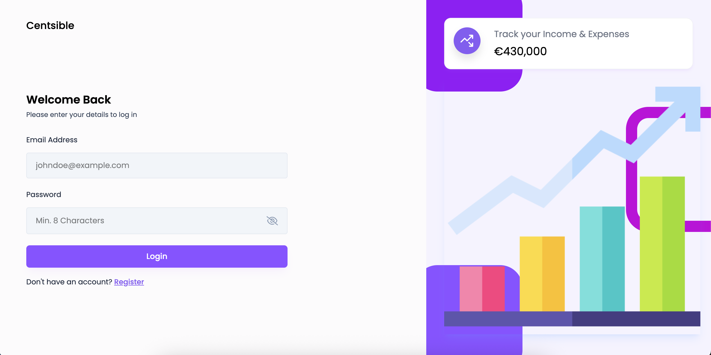
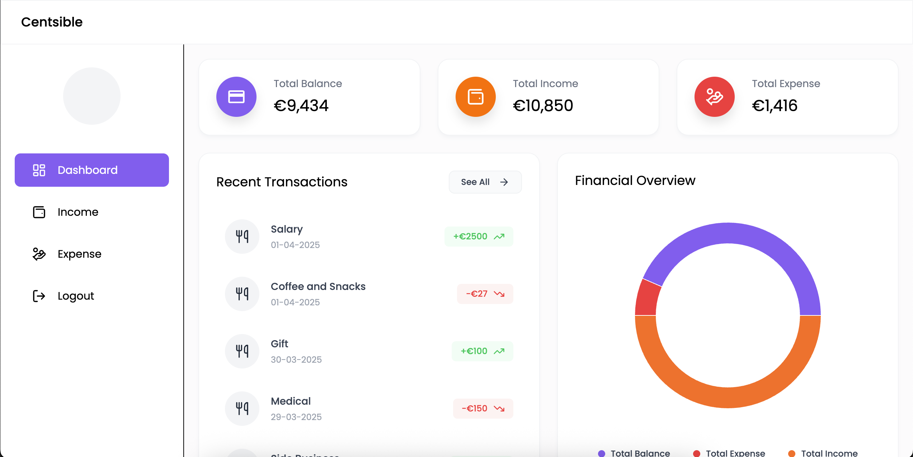
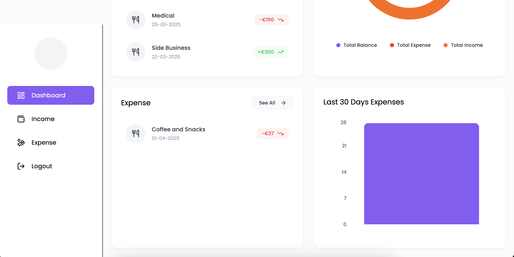
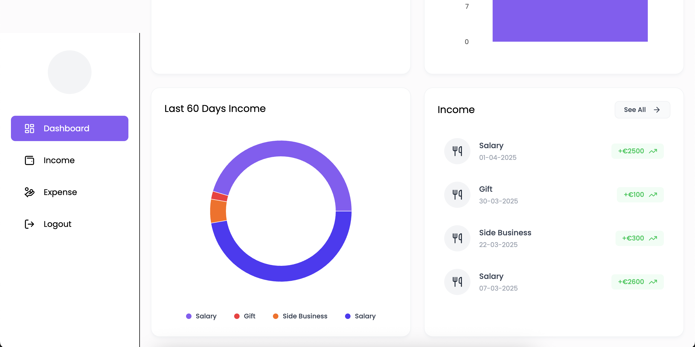
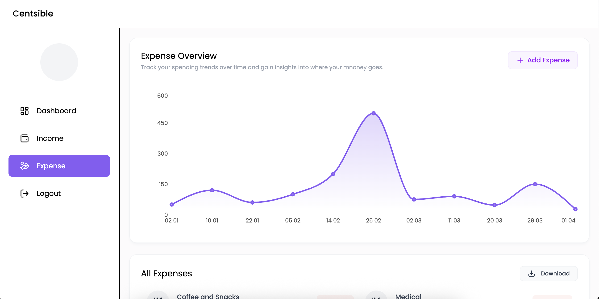
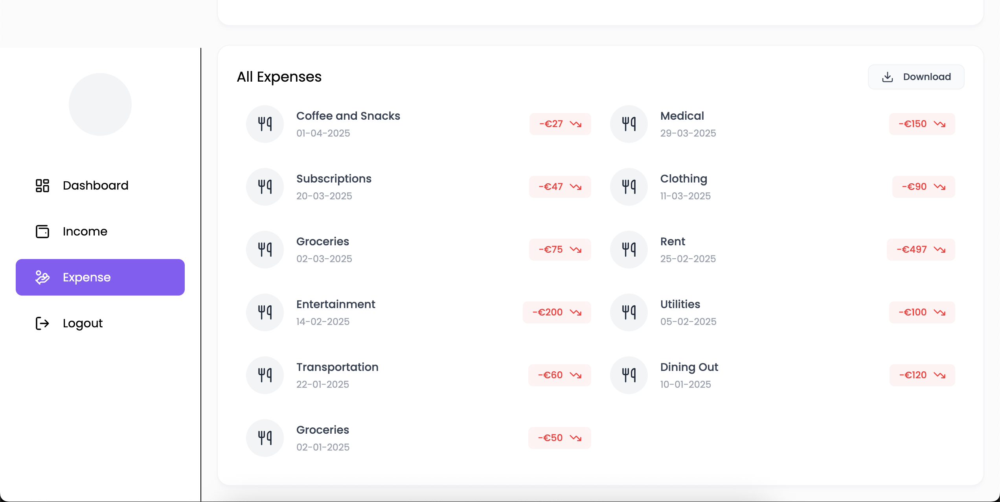
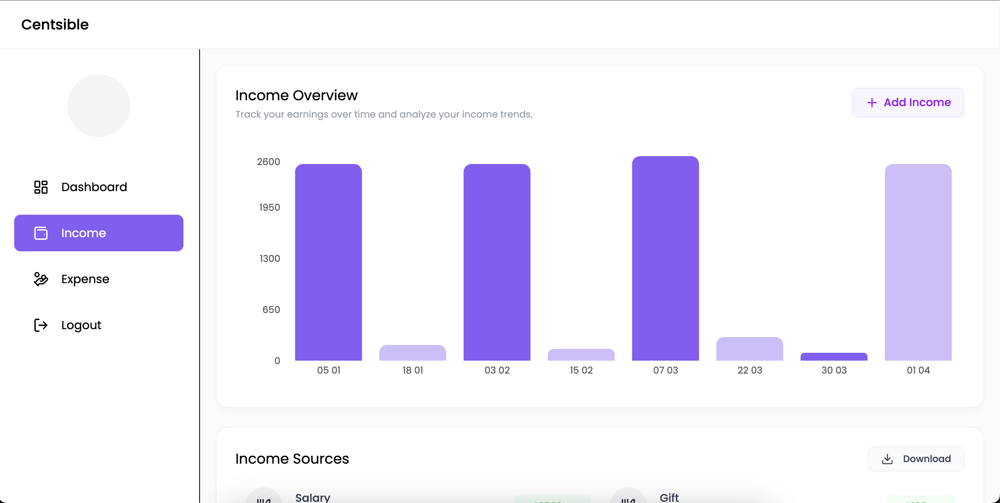
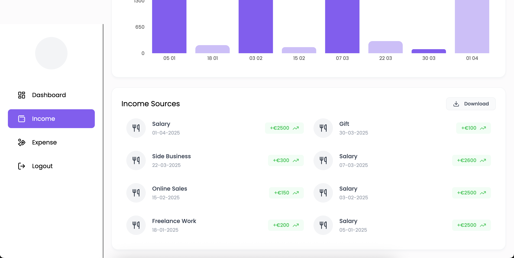

# 💸 Centsible - Expense Tracker App

A fully responsive **Expense Tracker App** built using the **MERN** stack (MongoDB, Express, React, Node.js). This powerful application enables users to manage their finances with features like income/expense tracking, interactive data visualizations, secure authentication, and data export capabilities.

## 🚀 Features

- 🔐 **User Authentication** – Secure sign-up and login with JWT.
- 📊 **Dashboard Overview** – Summarized view of Total Balance, Income, and Expenses.
- 💰 **Income Management** – Add, view, delete, and export income entries.
- 🧾 **Expense Management** – Add, view, delete, and export expenses with category tagging.
- 📈 **Interactive Charts** – Bar, Pie, and Line charts for financial insights.
- 🕒 **Recent Transactions** – Quick access to latest financial records.
- 📤 **Excel Export** – Download income and expense reports in Excel format.
- 📱 **Mobile Responsive UI** – Seamless experience across all device sizes.
- 🧭 **Intuitive Navigation** – Sidebar menu for easy navigation.
- ❌ **Delete Functionality** – Delete income/expenses quickly via hover interaction.

---

## 📂 Project Structure

### 🖥️ Frontend (React + Tailwind CSS)
- **React Setup** – SPA architecture with responsive design.
- **Tailwind CSS v4** – Utility-first CSS framework for styling.
- **Routing** – Defined routes for Auth, Dashboard, Income, and Expense pages.
- **Reusable Components** – Summary cards, charts, forms, and lists.
- **Axios Integration** – For making API requests with authentication headers.
- **Context API** – Manages user state and authentication globally.

### 🔙 Backend (Node.js + Express + MongoDB)
- **MongoDB Connection** – MongoDB Atlas/Mongoose integration.
- **Authentication APIs** – Sign-Up, Login, User Info, and Profile Upload (JWT-based).
- **Income APIs** – Add, Get, Delete, and Export income data.
- **Expense APIs** – Add, Get, Delete, and Export expense data.
- **Dashboard API** – Aggregated data for income, expenses, and balance.

---

## 🛠️ Functional Implementation Details

### 🔐 Authentication
- Login / Sign-Up pages
- User context for managing auth state
- JWT-based secure backend authentication
- Upload and display profile photos

### 📊 Dashboard
- Total Balance, Income, Expenses summary
- Recent Transactions list
- Pie Chart – Expense breakdown
- Bar Chart – Last 30 days of expenses
- Pie Chart – Last 60 days of income
- Interactive and responsive layout

### 💰 Income Page
- Form to add new income
- View income entries with delete functionality
- Excel download for all income records

### 🧾 Expense Page
- Add, view, and delete expenses
- Category-based tracking
- Excel download for all expense data

---

## 📸 Screenshots

















---

## 🧑‍💻 Setup Instructions

### 1. Clone the Repository

```bash
git clone https://github.com/harshpdani/centsible.git
cd centsible
```

### 2. Setup the Backend

```bash
cd backend
#Add your MongoDB URI, Port and JWT secret in .env file
npm run dev
```
### 3. Setup the Frontend

```bash
cd frontend/finance-tracker
npm run dev
```

---

## 🤝 Contributing

1. Fork the repo

2. Create a new branch 
```git checkout -b feature-xyz```

3. Commit your changes 
```git commit -m 'Added some feature'```

4. Push to the branch 
```git push origin feature-xyz```

5. Open a Pull Request

---

## 📃 License
This project is licensed under the [MIT License](LICENSE).